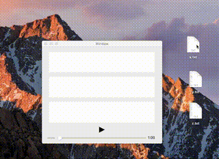

# imv
Integrative Movie Viewer (imv)

## What's this?
**Integrative Movie Viewer** (or **imv**) is an OSX application for visualizing a movie together with a corresponding time-series data (numeric or categorical). Time-series data will be visualized as a waveform (numerical) or an colored bar (categorical), and they will be automatically redrawn as you play, pause, and seek the movie. imv helps you bring boring lists of time-series data to life and boost your understanding on the data.

## demo (temporal)

## Prerequisites
You need Xcode >= 8.0 to build this project as imv is written in Swift3.

## Usage
### Input
imv adopts simple drag & drop interface. Currently, imv accepts 3 file types as input, `.mp4`(movie) ,`.txt`(numeric), and `.txt`(categorical). The following is a description of format.

#### movie
Just a mp4 is enough.

#### numeric

`.txt`(numeric) needs to be composed of 2 parts.

1. a configuration header starts with '#'
2. time-series numeric data stored line by line.

You can control how to draw a waveform by specifying configurations in the header line of `.txt`. Each configuration is a form of `Field=Value` and `;` is required as a separator.

e.g.) `#title=sample;fps=20;yMax=5;yMin=-5;windowSec=10`

The following is a description of each configuration field.

| Name | Type | Description |
|:--|:--:|:--|
|fps|Double|Frame rate for the time-series data|
|windowSec|Double|Time range for the plot window|
|title|String|Title of the data|
|yMax|Double|Upper limit for plot|
|yMin|Double|Lower limit for plot|

* **!!!FIELD NAME IS CASE SENSITIVE!!!**

#### categorical

`.txt`(categorical) needs to be composed of 3 parts.

1. a configuration header starts with '#'
2. a color configuration header starts with '##'
3. time-series numeric data stored line by line.

You can control how to draw a bar by specifying configurations in the header line.

e.g.) `#fps=20;windowSec=60`

You can also control the colors of a bar by specifying a HTML color code for each category. If not given any color code, white will be automatically assigned for the category.

e.g.) `##ctg1=002FDC;ctg2=289772;ctg3=FA919B`

### Padding
In case the first sample of time-series data does not correspond to 0 sec for the movie, you can specify the gap second in the field left bottom.
